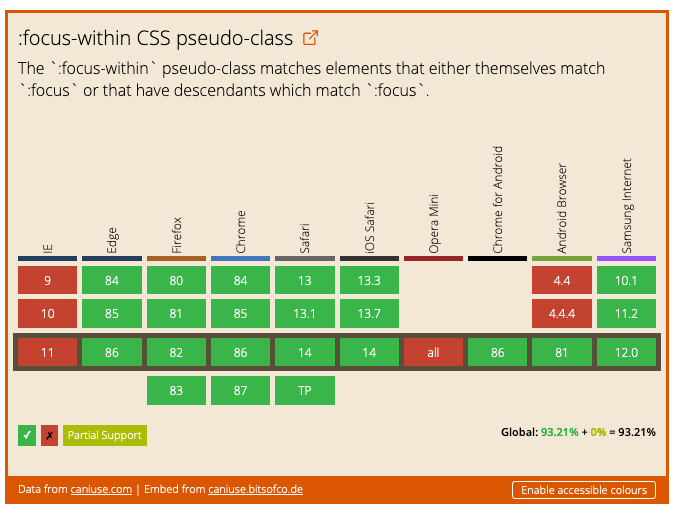

# caniuse-embed-element

> A custom elements wrapper around [Ire Aderinokun](https://twitter.com/ireaderinokun)'s [caniuse embed service](https://caniuse.bitsofco.de/)



## Basic usage

```html
<!-- Include the custom element script -->

<script src="node_modules/caniuse-embed-element/dist/caniuse-embed-element.min.js"></script>
<!-- Or from unpkg.com -->
<script src="https://unpkg.com/caniuse-embed-element/dist/caniuse-embed-element.min.js"></script>
```

After loading the element script, use the `caniuse-embed` element in your HTML.

```html
<!-- `feature` is the only required attribute -->
<caniuse-embed feature="css-focus-within"></caniuse-embed>

<!-- define the timeframe you're interested in -->
<caniuse-embed
  feature="mdn-css__properties__z-index"
  periods="future_1,current"
></caniuse-embed>

<!-- use accesssible colors -->
<caniuse-embed
  feature="focusin-focusout-events"
  show-accessible-colors="true"
></caniuse-embed>
```

## Contributing

This custom element is really just a wrapper around Ire's hard work on [caniuse.bitsofco.de](https://caniuse.bitsofco.de/) because I prefer custom elements. :)

And I don't plan to add any new features to it.

## Code of conduct

This project underlies [a code of conduct](./CODE-OF-CONDUCT.md).

## License

This project is released under [MIT license](./LICENSE).
